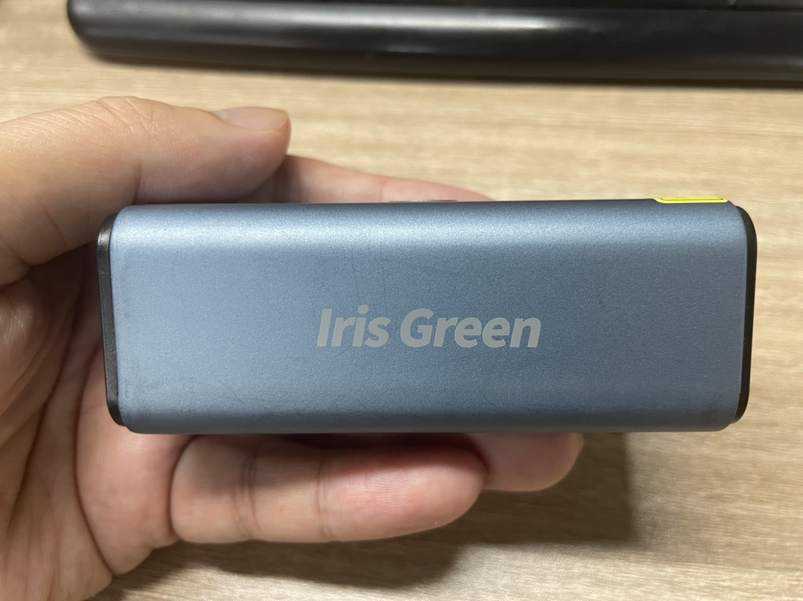
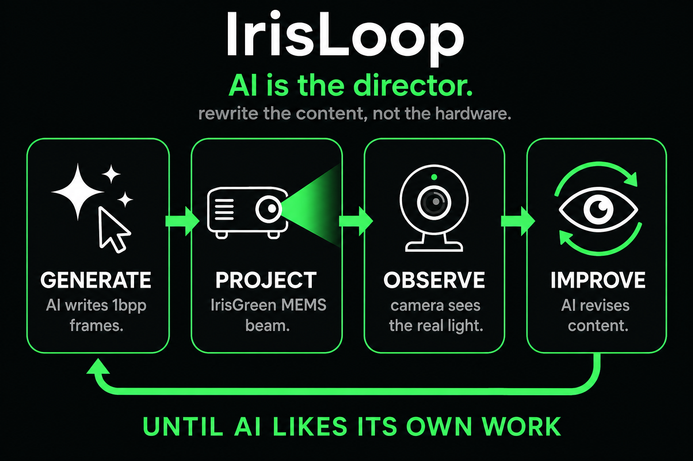

# IrisLoop

**AI is the director.** Rewrite the content, not the hardware.

Pocket green laser. Open loop. The beam gets better until AI likes its own work.

[Buy IrisGreen](https://irisarworld.com/irisgreen/?utm_source=github&utm_medium=readme&utm_campaign=irisloop)



**IrisGreen** is the product — a pocket MEMS laser from [AINSTEC](https://irisarworld.com/irisgreen/?utm_source=github&utm_medium=readme&utm_campaign=irisloop). Power it on, pair Bluetooth, point it at a wall.

**IrisLoop** is the open quickstart. You don’t tune distortion, FOV, or firmware. You let AI write the picture, throw it on the beam, look at the real light, and rewrite until the cut is worth signing.



Generate → Project → Observe → Improve. **Until AI likes its own work.**

That’s the whole pitch: a director that authors silhouettes, a writer that draws them, a laser that makes them physical, a camera that tells the truth.

---

## Why this exists

Most “AI + hardware” stories stop at a demo clip. IrisLoop is meant to be *played*:

- Unbox IrisGreen. The hardware is already calibrated.
- Run the loop on a laptop. Cursor, a webcam, Bluetooth.
- Watch the director refuse to sign a timid volcano — then ask for a fatter cut.
- Post the iteration. Fork the repo. Put *your* wish on someone else’s wall.

IrisLoop is not the consumer brand. It is how the brand shows up in public: think, project, observe, revise.

---

## Try it

```bash
pip install -r requirements.txt
python tools/loop_round1.py "viral dancing kitten" --rounds 3
```

Wish → director (Kimi K3) → writer (Wan) → IrisGreen group 1 → camera → director again.

Pass means the director **loves the silhouette**, not that a human can merely name the subject.

---

## For builders

Protocol, BLE bring-up, packing, and capture live in `docs/` and `tools/` — start here if you are wiring the device rather than running the show:

- [One-round closed loop](docs/loop-round1.md)
- [Wan writer](docs/wan-via-siliconflow.md)
- [Kling fallback](docs/kling-via-bailian.md)
- [Developer growth plan](docs/developer-growth-plan.md)
- [Hub submissions](hub/README.md)

```bash
python tools/min_play_test.py --ble --group 1 --seconds 5
python tools/project_and_capture.py --group 1 --seconds 6
```

---

IrisGreen hardware → [irisarworld.com/irisgreen](https://irisarworld.com/irisgreen/?utm_source=github&utm_medium=readme&utm_campaign=irisloop)

IrisLoop source → this repo. Open, iterable, unsigned until it’s loved.
